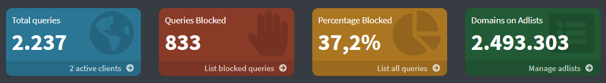

# Pi-hole adlist


This is the blocklist I use with my Pi-hole. It's compiled out of the individual lists I use, but in a single file. **Updated daily.**

It may not be perfect for everyone, but it's a good starting point. It mostly contains ads, telemetry and other questionable websites.

The list currently contains around *2.2* million unique domains.

The blocklist generator already cleans up a lot of the data. Still, after each update, the list is checked for domain validity and the results are displayed in the badges above.

## Usage

To use this list, simply add the following URL to your Pi-hole:

```text
https://raw.githubusercontent.com/Pyenb/Pi-hole-adlist/main/blocklist.txt
```

## Images



## Contributing

Pull requests are welcome. For major changes, please open an issue first to discuss what you would like to change.

[](https://www.gnu.org/licenses/gpl-3.0)

## Disclaimer

This repository is for research purposes only, the use of this code is your responsibility.

I take NO responsibility and/or liability for how you choose to use any of the source code available here. By using any of the files available in this repository, you understand that you are AGREEING TO USE AT YOUR OWN RISK. Once again, ALL files available here are for EDUCATION and/or RESEARCH purposes ONLY.
